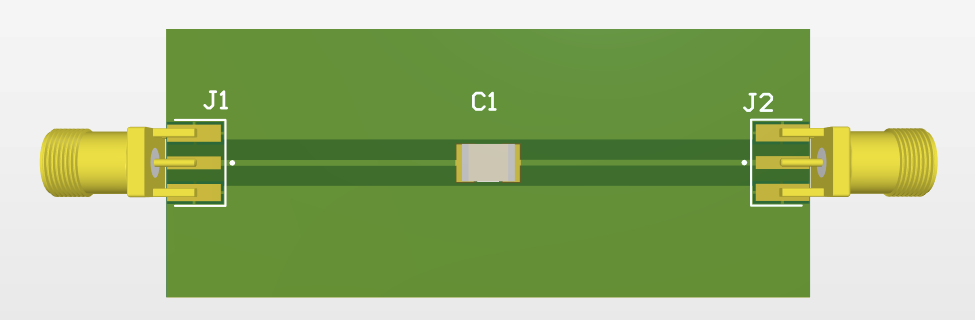
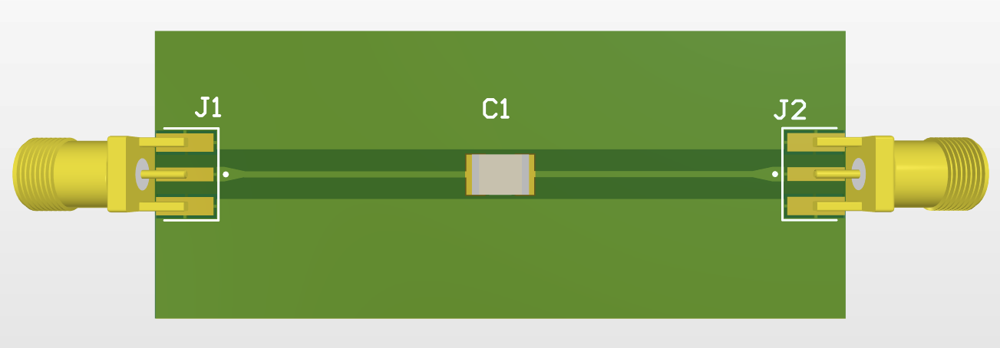

# RFTP1812
## Description
- RF Test Pad for 1812 Package, designed in Altium Designer.
- Board dimension: 60mm x 25mm
- RF trace: impedance control at 50Ω, ~0.5mm width
## Design Updates
### V1.0
- Initial board design

### V1.1
- Introduced tapered transition from pin pad to RF trace

